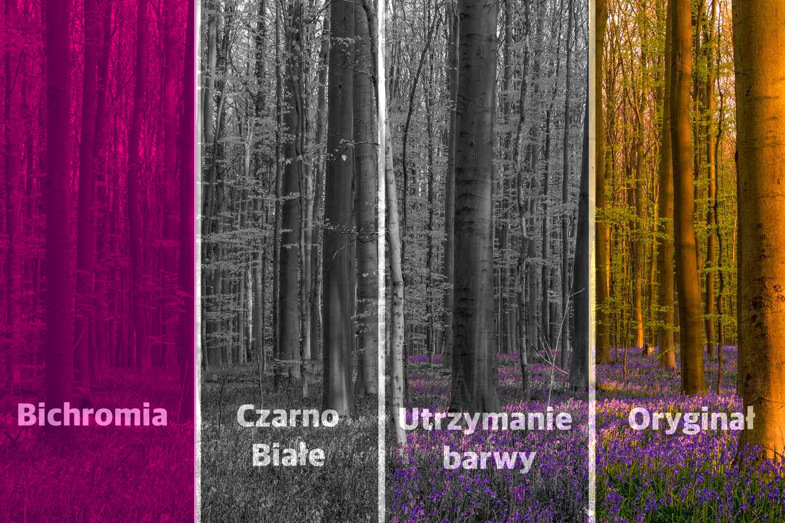

# Konwersja do odcieni szarości, projekt 26

## Opis
Ten projekt polega na stworzeniu aplikacji umożliwiającej przekształcanie obrazów z kolorowych do czarno-białych z różnymi opcjami manipulacji kolorami. Użytkownik może wybrać specyficzny kolor do zachowania, skonwertować obraz do skali szarości lub bichromii, oraz kontrolować wpływ poszczególnych kanałów kolorów RGB na konwersję do odcieni szarości.

## Technologie
* C++
* wxWidgets
* pugixml
* Visual Studio
* wxFormBuilder

## Funkcje
1. Wybór koloru do zachowania
2. Konwersja do skali szarości
3. Konwersja do bichromii
4. Kontrola wpływu kanałów RGB na konwersję do skali szarości
5. Zapisanie przetworzonego obrazu
6. Zapisanie ustawień jako plik XML

## Instalacja
Aby zainstalować projekt lokalnie, sklonuj to repozytorium i otwórz w środowisku Visual Studio. Następnie, zbuduj i uruchom projekt.

```
git clone [link do repozytorium]
```
Projekt wymaga również biblioteki wxWidgets, która powinna być umieszczona w folderze `wxWidgets` w głównym katalogu.
## Użycie
Po uruchomieniu aplikacji, wczytaj obraz za pomocą przycisku "Wczytaj obrazek". Następnie, używając suwaków i przycisków, dostosuj efekt końcowy do swoich preferencji. Przetworzony obraz możesz zapisać za pomocą przycisku "Zapisz obrazek". Aby zapisać aktualne ustawienia, użyj przycisku "Zapisz parametry".


## Demo




## Współpraca
Projekt został zrealizowany przez trzyosobowy zespół. Każdy z członków zespołu miał swoją rolę w tworzeniu algorytmów i modułów aplikacji.


